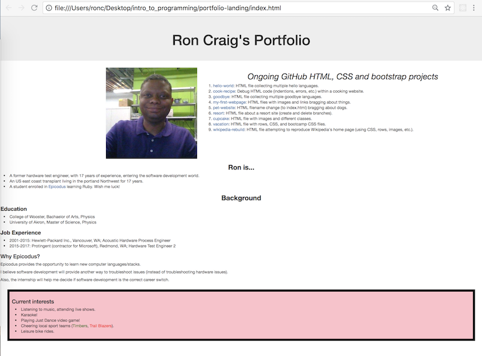

# portfolio-landing

## GitHub repository: https://github.com/r-craig73/portfolio-landing

#### First landing page for a personal portfolio, Version 1.01, 01/05/2018
#### By Ron Craig (ron.craig@comcast.net)

## Description
#### Create a portfolio webpage using HTML and CSS.
#### Will be used as a landing page for several GitHub repositories.

## Setup instructions
### Starting from scratch, create the following files...
* bootstrap.css, styles.css, readme (markdown file), and index.html files
### HTML `index` file includes the following...
* My name & image
* Projects created in GitHub
* Personal background and current interests/hobbies/skills.

## Setup
* Clone the repository
* Open `index.html` in any web browser.

## Known Bugs
* None.  Maybe updating the bootstrap file late 2018.

## Technologies Used
* HTML, CSS & bootstrap

## Links to GitHub projects pages (Week 1: Introduction to Programming)
* https://github.com/r-craig73/hello-world
* https://github.com/r-craig73/cook-recipe
* https://github.com/r-craig73/goodbye
* https://github.com/r-craig73/my-first-webpage
* https://github.com/r-craig73/pet-website
* https://github.com/r-craig73/resort
* https://github.com/r-craig73/cupcake
* https://github.com/r-craig73/vacation
* https://github.com/r-craig73/wikipedia-rebuild

## Technologies Used
* HTML, CSS & bootstrap

## MIT License

#### Copyright (c) 2018 _Ron Craig_
